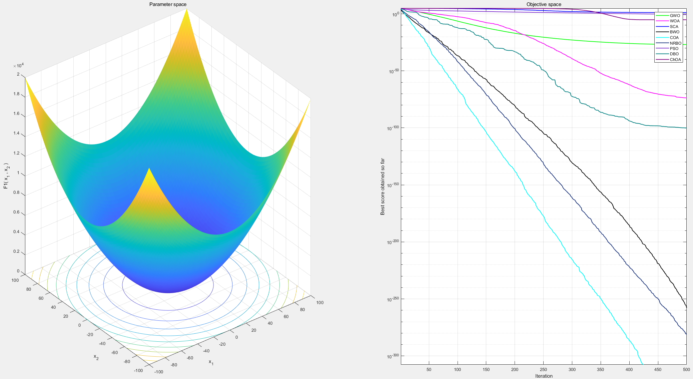
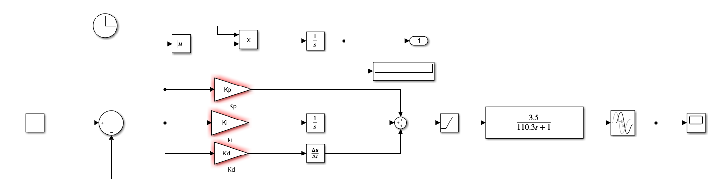

# 运行环境

MATLAB R2020a

# 程序运行

## 基准函数测试

1. 添加文件路径

2. 运行 `test_on_the_function.m`

# PID参数优化

传递函数：

$$ \Huge G(s)=\frac{3.5}{110.3\mathrm{s}+1}\mathrm{e}^{-2s}$$

适应度函数：

$$\Huge J=\int_0^{t_f}t|e(t)|\mathrm{d}t$$

## BWO

运行`run_BWO.m`，每次迭代耗时700多秒

其他算法同理。